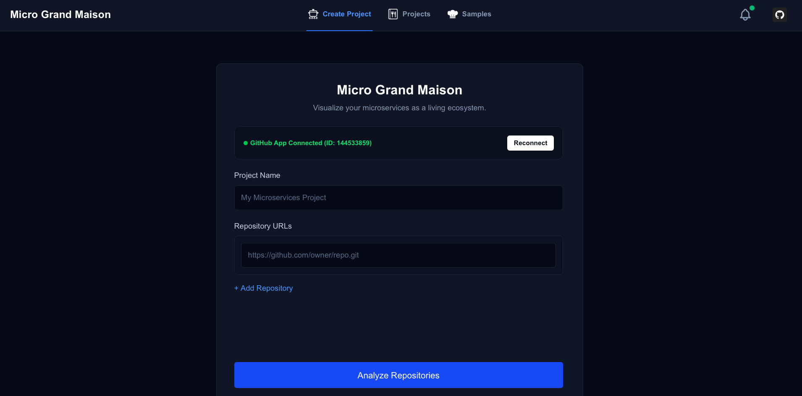
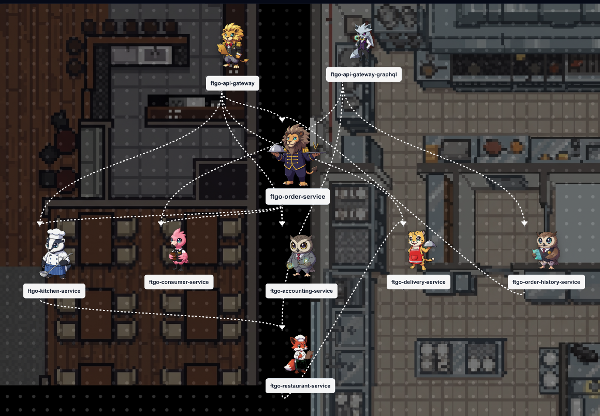
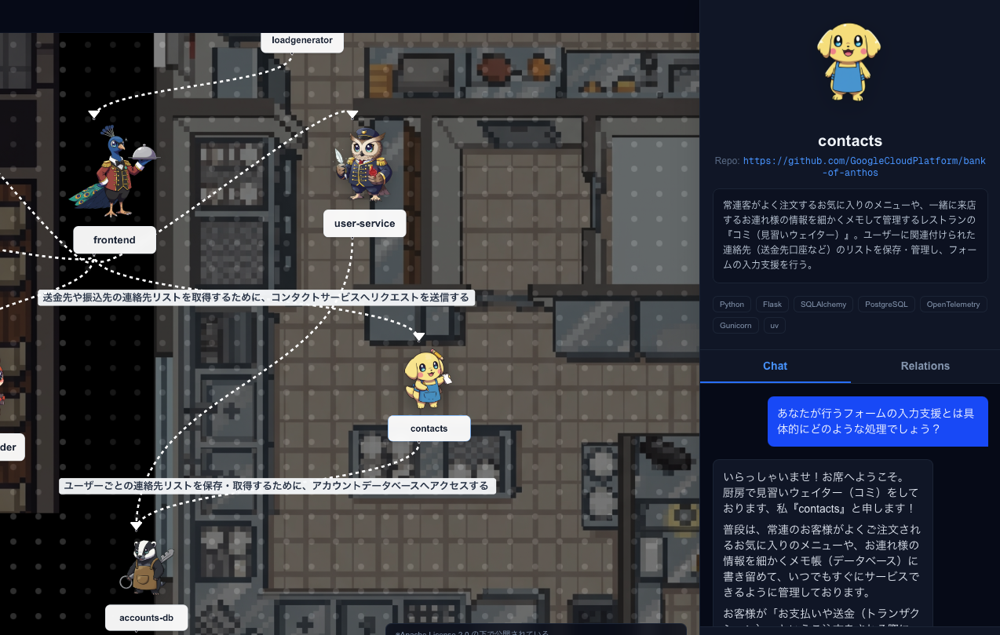

# Micro Grand Maison (マイクロ・グランメゾン)

ファインディ株式会社 / Findy Inc. 主催の DevOps AI Agents Hackathon 2026 に向けて開発したアプリケーションです。

## 🌟 アプリケーション概要

**Micro Grand Maison** は、複数のリポジトリやコンポーネントで構成される複雑なシステムを、**「動物たちが働くレストラン（グランメゾン）」のアナロジー**に自動変換するシステムです。

* **キャラクターアバター生成**: 各マイクロサービスの特徴やコード構造、規模を分析し、最適な動物キャラクター（アバター）を生成します。
* **2D店舗マップ風ダイアグラム**: マイクロサービス同士の関係性とそれぞれの役割（ホール、キッチン、デザート担当など）を、店舗レイアウトを模した 2D ダイアグラムマップ上に配置し可視化します。
* **自律探索チャット対話**: 各キャラクターとの対話を通してシステムの仕組みを学習できます。チャットの裏側では、Gemini が最大 100KB におよぶコードファイルを自律的に探索（Agentic Retrieval）し、実際のソースコードの実装に基づいた正確でフレンドリーな説明を行います。
* **Git Webhook連携**: GitHub へのコード push を検知し、最新のアーキテクチャ構造と説明文、アバターを全自動で再解析・再生成します。

---

## 📸 アプリケーション画面

### 1. プロジェクトの作成と解析（リポジトリの登録）
プロジェクト名と可視化したいマイクロサービス群のリポジトリ URL を入力して解析を実行します。GitHub App 連携により、プライベートリポジトリのセキュアな解析にも対応しています。

### 2. 2D コンポーネントダイアグラム（店舗マップ）
解析完了後、各マイクロサービスが擬人化されたアバター（レストランスタッフ）となって 2D ダイアグラム（レストランマップ）上に配置され、サービスの境界や関係性が視覚的かつ直感的に表現されます。

### 3. アバター（店舗スタッフ）とのチャット対話
特定のサービスをクリックするとチャットドロワーが開き、キャラクターが自身の担当する最新のソースコードを読み解いて、その役割や API の仕様についてフレンドリーに教えてくれます。

---

## 📂 サブプロジェクト・リポジトリ一覧

システムは以下の 4 つのリポジトリに分割して構成されています。

### 1. [micro-grand-maison-web](https://github.com/tngldrl/micro-grand-maison-web) (Frontend Web App)
* **概要**: システムのビジュアルダッシュボードを提供するフロントエンド。
* **技術スタック**: Next.js (App Router), React, ReactFlow, Tailwind CSS, Firebase Auth (GitHub 連携)
* **主な役割**:
  * 2D ダイアグラムマップの滑らかなレンダリング。
  * キャラクターごとのチャットドロワーインターフェース。
  * 新規プロジェクト登録、過去プロジェクト一覧、Webhook プッシュ通知一覧、管理者用デモ登録機能。

### 2. [micro-grand-maison-api](https://github.com/tngldrl/micro-grand-maison-api) (Core Backend API)
* **概要**: システム全体のデータ永続化とリクエスト制御を担うバックエンド API。
* **技術スタック**: FastAPI, SQLAlchemy (PostgreSQL / SQLite), Pydantic
* **主な役割**:
  * プロジェクト情報、リポジトリ設定、チャット履歴の管理と保存。
  * GitHub App Webhook の受け口となり、push 検知時に再解析キューを管理。
  * チャット対話時に、Gemini がコードを自律的かつ段階的に GitHub から取得（Agentic Retrieval）するバックエンド探索ロジックの提供。

### 3. [micro-grand-maison-mcp](https://github.com/tngldrl/micro-grand-maison-mcp) (Model Context Protocol / AI Analysis Server)
* **概要**: AI 連携のコア処理（コードスキャン、グラフ合成、画像生成、キャラクターチャット）を担う AI バックエンド。
* **技術スタック**: FastAPI, Google Gen AI SDK (Gemini 1.5 Flash), Imagen 3, PIL (Pillow)
* **主な役割**:
  * Git リポジトリのクローンとコード의 メタデータスキャン。
  * 複数リポジトリの構造を統合した論理システムアーキテクチャの合成。
  * **Imagen 3** を用いたクロマキー背景キャラクター画像の生成と、HSV 色空間を用いた高精度なアルファ透過処理。
  * キャラクターの人格プロンプト構築と Gemini チャット推論の実行。

### 4. [micro-grand-maison-infra](https://github.com/tngldrl/micro-grand-maison-infra) (Infrastructure as Code)
* **概要**: Google Cloud (GCP) 上のリソース定義とデプロイを管理するインフラ用コードリポジトリ。
* **技術スタック**: Terraform
* **主な役割**:
  * Cloud Run サービス（Web, API, MCP）のデプロイ定義。
  * キャラクターアバター格納用の Cloud Storage (GCS) バケットの構築。
  * ネットワーク、IAM サービスアカウント（Vertex AI アクセス権限等）、および環境変数の統合管理。
